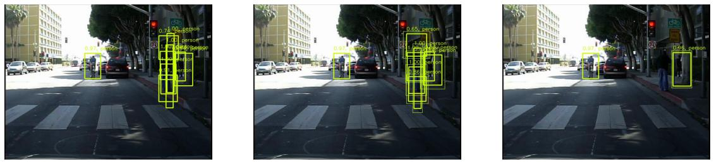
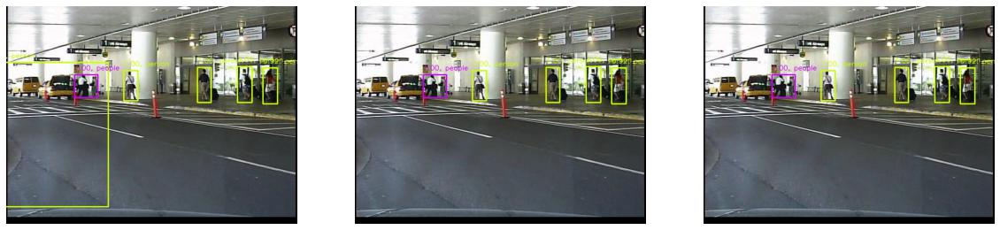
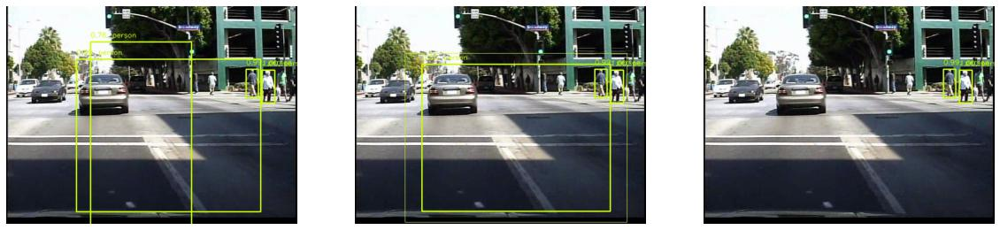

#  MC-Dropout SSD300
The contents of this repository are the topic of my bachelor's thesis. You can find it [at this link](https://fse.studenttheses.ub.rug.nl/28357/).

This repository relies heavily on code from the the [Perception for Autonomous Systems (PAZ)](https://github.com/oarriaga/paz) library.

## SSD300 model
The model that is implemented in this repository is an Single Shot Detector with dropout layers that are on during inference time, thus enabling uncertainty quantification via model sampling. Our evaluation on the Caltech Pedestrian Dataset has shown it to successfully filter out "bogus" predictions and lead to a notable increase in mAP. However, our evaluation is limited, and we welcome further results!





## Setup
The required environment can be installed via ``` conda install environment.yml ```. If this fails, simply install based on the error messages that pop up :)

## Model usage
The simplest way to train and test the model is by using the ```train_model.py``` and ```test_model.py``` files in the root directory. 
